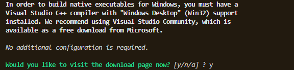
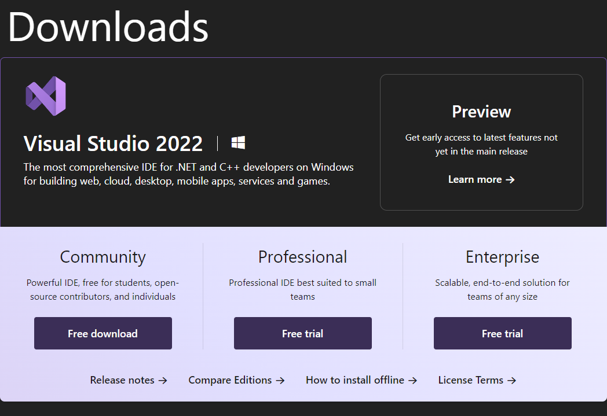
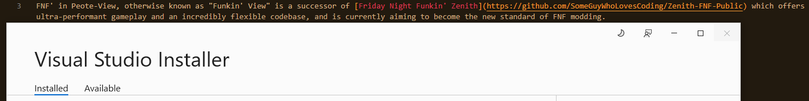

# Welcome!

Funkin' View (AKA FNF' in Peote-View) is a successor of [Friday Night Funkin' Zenith](https://github.com/SomeGuyWhoLovesCoding/Zenith-FNF-Public) and is the fastest running opengl fnf engine in haxe of now.

This is being optimized and organized as frequently as possible for a flexible codebase making it faster to finish. It aims to be the new standard of FNF modding.

This project was started a few months ago, so expect this repository to be very active!

- [-] Currently on break

# Setup

Instll these haxelibs:

Lime - ``haxelib install lime``

Peote-view - ``haxelib git peote-view https://github.com/maitag/peote-view.git``

HXCPP - ``haxelib install hxcpp``

Format - ``haxelib install format`` (This one is also used in peote-view for `TextureData.fromFormatPNG`)

Miniaudio - ``haxelib git miniaudio https://github.com/alchemy-haxe/genkit_miniaudio.git``

After that, make sure that you are on this screen:

And press "y" to go to the download page for visual studio.

PRESS COMMUNITY!

And it'll automatically download the setup executable for you.

Make sure that you're looking at this window:

Then, you want to go to the Windows 10 SDK (10.0.19041) and MSVC v143 - VS 2022 C++ x64/x86 build tools (Latest). That's literally it.

(Oh yeah and it requires at least 6GB of free storage space on a drive to install btw)

And you're all set up! Just run `lime test cpp` and it works!

# Credits

- SomeGuyWhoLikesCoding

(AKA SomeGuyWhoLikesFNF, VeryExcited, 0x1DFA7D (someguywhouhhhhh), [SomethingIsItchy](https://somethingisitchy.itch.io), [FelixTheCat](https://gamejolt.com/@SomeGuyWhoLikesFNF), or simply Jeremiah):

: Owner, Maintainer, and Programmer

- Halfwat

(AKA jobf)

: Helped me learn how peote-view works, wrote the sprite clipping sample for peote-view, and more.

- Semmi

(AKA Semmis, maitag, or simply Sylvio Sell)

: Wrote peote-view, and wrote the `slices` shader sample for the sustain note.

- MKI

: Generated the miniaudio bindings via genkit (listed above)
